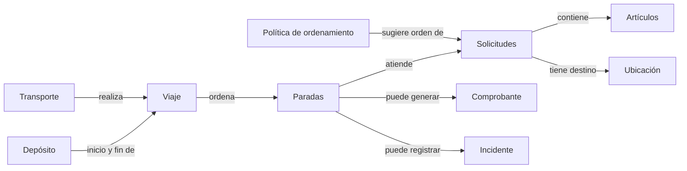
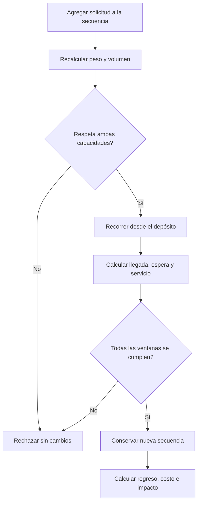

# Trabajo Práctico: Planificación de Entregas Urbanas

## Situación Hipotética

**Logística Inteligente S.A. (LISASA)** distribuye paquetería desde un depósito urbano con motocicletas, furgonetas y camiones. Hoy arma viajes en planillas: algunas cargas exceden peso o volumen, las nuevas paradas vuelven incumplibles ventanas ya comprometidas y los incidentes no quedan vinculados con la entrega afectada.

La empresa solicita un prototipo para construir y ejecutar viajes factibles sobre una matriz de distancias conocida. El sistema valida una secuencia propuesta y calcula sus resultados; no busca la ruta óptima ni asigna solicitudes automáticamente.

### Objetivo del sistema

El prototipo deberá permitir:

- registrar ubicaciones, solicitudes y transportes;
- agregar solicitudes a una secuencia de viaje y revalidar toda la ruta;
- controlar peso, volumen y ventanas horarias;
- calcular horarios, distancia, costo e impacto ambiental estimado;
- iniciar un viaje y registrar entregas o intentos fallidos;
- emitir comprobantes y conservar incidentes trazables;
- sugerir un orden de solicitudes mediante una política consultiva sin modificar el viaje.

### Modelo operativo simplificado

Cada viaje ocurre en una fecha, sale de un único depósito y regresa a él. Se proporciona una matriz dirigida de distancias en kilómetros entre todas las ubicaciones utilizadas. La velocidad media es constante por tipo de transporte y cada parada insume `10 minutos` de servicio. El tiempo de recorrido de un tramo es `distancia / velocidad`; no se modelan tránsito, descanso ni carga inicial.

### Alcance y vocabulario del dominio

| Concepto | Representa | Es responsable de | No es responsable de |
| --- | --- | --- | --- |
| Transporte | Un vehículo disponible | Identidad, capacidades, velocidad, costos y factor ambiental | Elegir solicitudes automáticamente |
| Solicitud | Una entrega indivisible | Artículos, destino y ventana horaria | Definir su posición en el viaje |
| Artículo | Una unidad de carga | Peso y volumen | Conocer el transporte asignado |
| Ubicación | Un punto de la matriz | Identidad y descripción | Calcular rutas por sí sola |
| Viaje | Una secuencia planificada para una fecha | Transporte, depósito, solicitudes, horarios y estado | Optimizar el orden de las paradas |
| Parada | La visita a una solicitud | Orden, llegada prevista y resultado | Reutilizarse en otro viaje |
| Comprobante | La evidencia de una entrega | Solicitud, fecha real y receptor | Existir para un intento fallido |
| Incidente | Un problema durante el viaje | Tipo, fecha, descripción y entidad afectada | Cambiar por sí solo la planificación |
| Política de ordenamiento | Una estrategia para sugerir un orden de solicitudes | Recibir una secuencia candidata y devolver un orden sugerido | Modificar el viaje ni confirmar asignaciones |

El mapa no prescribe clases ni una estructura de colecciones.

### Cálculo de un itinerario

La llegada a la primera parada se obtiene desde la hora de salida. Si se llega antes del inicio de su ventana, el transporte espera y comienza el servicio al inicio. Si se llega luego del fin, la secuencia es inviable. Las paradas siguientes parten de la finalización del servicio anterior. La vuelta al depósito suma distancia y tiempo, pero no está sujeta a una ventana.

### Ejemplo de aceptación

Una furgoneta admite `500 kg` y `8 m³`, viaja a `30 km/h`, cuesta `$2` por kilómetro y `$5` por parada, y tiene un factor ambiental de `0,27 kg CO₂/km`. Sale a las `09:00`. La solicitud `S1` pesa `100 kg`, ocupa `2 m³`, está a `15 km` del depósito y tiene ventana `09:20–10:00`. `S2` pesa `150 kg`, ocupa `3 m³`, está a `10 km` de `S1`, tiene ventana `10:00–11:00`, y su destino queda a `20 km` del depósito.

La llegada a `S1` es `09:30`; termina a `09:40`. La llegada a `S2` es `10:00`; termina a `10:10`. La carga total es `250 kg` y `5 m³`, y la distancia completa es `15 + 10 + 20 = 45 km`. El costo es `45 * 2 + 2 * 5 = $100`. El impacto estimado es `45 * 0,27 = 12,15 kg CO₂`. La secuencia es factible. Si la ventana de `S2` terminara a `09:55`, agregarla se rechazaría y el viaje conservaría únicamente `S1`.

Una política de vecino más cercano consultada antes de armar el viaje devolvería `[S1, S2]` como orden sugerido dado que `S1` está más cerca del depósito; esa sugerencia no crea ni modifica ningún viaje.

### Fuera de alcance

No se requiere interfaz gráfica, persistencia, GPS, tránsito real, geocodificación, múltiples depósitos por viaje, recolecciones, división de solicitudes, asignación automática de flota, combustible ni facturación. La política de ordenamiento sugiere pero no confirma: la decisión final siempre corresponde al operador.

## Requerimientos Técnicos Obligatorios

- Implementar la solución con Programación Orientada a Objetos y separar el punto de entrada de la lógica del dominio.
- Identificar y justificar una jerarquía de herencia que represente una especialización válida entre tipos de transporte, con variación polimórfica real en el cálculo de impacto ambiental.
- Aplicar polimorfismo en al menos un comportamiento adicional: las políticas de ordenamiento deben ser intercambiables sin modificar el núcleo del sistema.
- Encapsular secuencia, carga y estados; no se podrán agregar paradas ni completar entregas modificando atributos directamente.
- Implementar el recorrido secuencial y sus acumulaciones con estructuras nativas, sin librerías de ruteo u optimización.
- Definir excepciones propias para datos inválidos, capacidad excedida, ruta incompleta, ventana incumplida y transición ilegal.
- Utilizar `date`, `time`, `datetime` y `timedelta` de la biblioteca estándar con una convención numérica consistente.
- Escribir pruebas unitarias con `pytest` para cálculos, límites, atomicidad, estados y trazabilidad.

## Reglas de Negocio

1. **Identidad y magnitudes:** Los identificadores de transportes, solicitudes, ubicaciones y viajes son únicos dentro de su categoría y no vacíos. Peso, volumen, velocidad, costo por kilómetro y factor ambiental son positivos; el costo por parada es no negativo.

2. **Solicitudes válidas:** Una solicitud contiene al menos un artículo, un destino distinto del depósito y una ventana con inicio anterior o igual al fin. Su peso y volumen son las sumas de sus artículos y no pueden modificarse luego de incorporarla a un viaje.

3. **Matriz completa:** Cada tramo utilizado debe tener una distancia no negativa definida en el sentido recorrido. La distancia entre una ubicación y sí misma es cero. Si falta un tramo, el cálculo se rechaza sin modificar el viaje.

4. **Carga indivisible:** La suma de peso y la suma de volumen de todas las solicitudes no pueden superar las capacidades inclusivas del transporte. Deben cumplirse ambos límites; una solicitud no se divide entre viajes.

5. **Solicitud única:** Una solicitud puede pertenecer como máximo a un viaje `PLANIFICADO` o `EN_CURSO`. Dentro de un viaje aparece una sola vez. Una solicitud entregada no puede volver a planificarse.

6. **Horario secuencial:** Cada tramo demora `distancia / velocidad`. Al llegar antes de una ventana se espera; llegar exactamente al fin es válido. Cada servicio dura `10 minutos` y la siguiente salida ocurre al finalizarlo.

7. **Revalidación atómica:** Al agregar, quitar o reordenar una solicitud en un viaje planificado, se recalculan desde el depósito la carga y todas las ventanas. Si cualquier regla falla, la secuencia, horarios y resultados anteriores permanecen intactos.

8. **Distancia y costo:** La distancia total incluye salida, tramos entre paradas y regreso al depósito. El costo es `distancia_total * costo_por_km + cantidad_de_paradas * costo_por_parada`; las esperas no agregan costo en este prototipo.

9. **Impacto ambiental:** Cada tipo de transporte calcula su estimación mediante un comportamiento propio que, como mínimo, depende de la distancia total y su factor ambiental. La unidad elegida debe declararse, el cálculo varía según el tipo de vehículo y no cambia el estado del viaje.

10. **Estados del viaje:** Un viaje nace `PLANIFICADO`, puede pasar a `EN_CURSO` y luego a `FINALIZADO`. Solo se inicia si tiene al menos una parada y su itinerario sigue siendo factible. La secuencia no puede modificarse después de iniciar.

11. **Resultado de una parada:** En un viaje en curso, cada parada pendiente termina una sola vez como `ENTREGADA` o `FALLIDA`, respetando el orden planificado. Una entrega genera exactamente un comprobante con solicitud, fecha y hora reales, y receptor no vacío; una fallida exige al menos un incidente y no genera comprobante.

12. **Incidentes y finalización:** Un incidente tiene tipo `DAÑO`, `AUSENTE` o `RETRASO`, descripción no vacía, instante y referencia a una solicitud o al transporte del viaje. El viaje solo finaliza cuando todas sus paradas tienen resultado; las consultas de costo, impacto e incidentes no alteran estados.

13. **Política de ordenamiento:** Una política recibe un depósito, una lista de solicitudes y la matriz de distancias, y devuelve un orden sugerido sin modificar ningún viaje ni reservar recursos. El sistema debe soportar al menos dos políticas intercambiables; la política no garantiza factibilidad de ventanas ni capacidad.

### Pruebas mínimas esperadas

- identificadores duplicados, magnitudes inválidas y ventanas límite;
- exceso solo de peso, solo de volumen y valores exactamente en capacidad;
- tramo faltante y matriz dirigida;
- llegada antes del inicio, exactamente al fin y un minuto tarde;
- agregado o reordenamiento inviable sin cambios parciales;
- distancia de ida, tramos y regreso; costo con varias paradas;
- impacto ambiental de dos tipos de transporte distintos con el mismo recorrido;
- doble asignación de una solicitud;
- inicio vacío y modificación luego de iniciar;
- orden de resultados, comprobante único e intento fallido;
- dos políticas de ordenamiento aplicadas a la misma lista producen resultados distintos sin alterar el estado;
- consultas sin efectos secundarios.

### Decisiones de diseño que deberán resolver

- ¿Qué objeto recorre la secuencia y conserva juntos horarios y distancias coherentes?
- ¿Cómo se representa una propuesta de cambio para validarla antes de reemplazar el itinerario?
- ¿Los totales de carga se almacenan o se calculan? ¿Cómo se evita su desactualización?
- ¿Cómo varía el impacto ambiental sin preguntar explícitamente el tipo de transporte?
- ¿Dónde se controlan el orden y los estados de las paradas?
- ¿Cómo se distingue un cálculo consultivo de una transición operativa?
- ¿Qué interfaz deben cumplir las políticas de ordenamiento para ser intercambiables sin modificar el viaje?

No existe un diagrama de clases oficial. Se evaluarán invariantes, responsabilidades, bajo acoplamiento y pruebas que expliquen el ejemplo.

### Evolución durante el semestre

1. **Catálogo logístico:** transportes con tipos especializados y cálculo ambiental polimórfico, ubicaciones, solicitudes, artículos y validaciones locales.
2. **Itinerario:** matriz, recorrido temporal, ventanas, capacidad y cambios atómicos.
3. **Operación:** estados, entregas, fallos, comprobantes e incidentes.
4. **Optimización consultiva:** al menos dos políticas de ordenamiento intercambiables —por ejemplo vecino más cercano y menor ventana primero— como objetos separados que sugieren un orden y permiten comparar el costo estimado de dos secuencias alternativas sin modificar ningún viaje.
5. **Cambio controlado:** la cátedra elegirá una extensión —por ejemplo tiempos de servicio variables según el peso de la carga, recolecciones o cancelación de un viaje en curso— para evaluar la adaptabilidad del modelo.

Cada incremento deberá conservar las pruebas anteriores y actualizar brevemente el diagrama y las decisiones afectadas.

## Notas

- Se prohíbe `pandas` y cualquier librería de optimización o ruteo; se evaluarán recorridos y acumulaciones implementados por ustedes.
- Antes de codificar, presenten un diagrama de responsabilidades y relaciones. Los mapas del enunciado no prescriben clases.
- Cada implementación deberá estar sustentada y las reglas críticas demostradas mediante pruebas automatizadas.
- Se permite la biblioteca estándar de Python; las distancias y ubicaciones son datos locales, no servicios externos.
